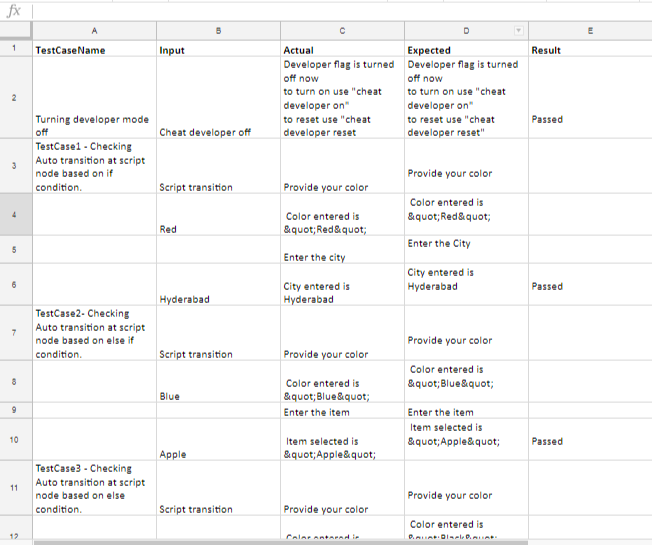

**Kore.ai**

**Chatbot Test Runner**

[Overview](#Overview)  
[Prerequisites](#Prerequisites)  
[Chatbot Test Runner](#Chatbot-Test-Runner)  
[Configuring the Test Runs](#Configuring-the-Test-Runs)  
[Track and Report the Results](#Track-and-Report-the-Results)

## Overview

Kore.ai Chatbot Test Runner enables you to substantially cut down your bot development team’s QA efforts by automating the creation, execution of test cases, and fast-track bug fixing by providing comprehensive test results and steps to reproduce. 

As with regular bot testing, the first step is to define different test scenarios and flows and interacting with the bot to check the responses. However, most of what follows next reduce the manual efforts to a large extent. 

The Chatbot Test Runner records these interactions and organizes them into test cases that included your entries as inputs and bot responses as the expected output. You can conduct any number of chat sessions to record separate test suites depending on your test strategy. You can download the recorded test suites for reuse and edit them to better suit your test expectations. The tool also allows you to download the Steps to Reproduce (STR) file for all your bot interactions. You can use these steps to reduce the redundancy of having to write the content all over again when you are reporting the bugs. 

Once you finalize the test suites, you can put them back into the Chatbot Test Runner to execute these test cases at various stages of your bot development, without investing enormous bandwidth in conducting the interactions all over again. 

Every time you run the test cases using the Chatbot Test Runner, it produces a Test Results spreadsheet for each test suite. The spreadsheet provides a comprehensive report of the test run, with the developer input, actual and expected results, and the status the test run as passed or failed. You can use this spreadsheet to report, keep a track of, and re-test the failed test cases.

## Prerequisites

* **Python 3.7:** The Chatbot Test Runner requires Python 3.7 or later version to run the automated test scripts. If you do not already have the software, download the suitable version for your operating system from here: [https://www.python.org/downloads/](https://www.python.org/downloads/)

* **Kore.ai Web SDK Configuration:** Kore.ai offers Bots SDKs as a set of platform-specific client libraries that provide a quick and convenient way to integrate Kore.ai Bots chat capability into custom applications. The Bots Web SDK contains HTML5 and JavaScript libraries that enable you to talk to Kore.ai bots over a web socket. You need to configure the Bots Web SDK to be able to use the Chatbot Test Runner on your bot applications. [Read how to configure Web SDK](#bookmark=id.r2ivhwkjsmln)

## Chatbot Test Runner

**Configuration Steps**

Configuring Chatbot Test Runner involves the following major steps:

* **Step 1:** **Download the Chatbot Test Runner from GitHub :** The [Chatbot Test Runner repo](https://github.com/Koredotcom/chatbot-test-runner) contains the necessary libraries to configure, record and run the test cases over Web SDK. 

* **Step 2**: **Plan, Record, and Download Test Cases**: Define the various scenarios to test along with expected outcomes. Execute these interactions with the bot. The Chatbot Test Recorder records the entire interaction and organizes them as the test cases which you can download and edit later. Also, you can plan the interactions in a way that suits your testing strategy such as by task, sub-tasks, etc. For example, let’s consider you want to manage the test cases for each bot task separately. In that case, you can execute the interactions in such a way that they reflect the flows in the specific task. After completing the testing of scenarios in that task, you can end the conversation. The recorded Test Cases file now only includes the task-specific cases. Similarly, you can run more interactions for the other bot tasks and download the respective TestSuite files. Please refer the mentioned link  to know the process of recording test cases https://developer.kore.ai/docs/bots/bot-builder/getting-started-bots/talk-to-your-bot/

* **Step 3: Auto-Run the Test Suites:** Once you record one or more Test Suites, you can execute them with little manual intervention anytime later. You need to upload the test suites to the Test Runner and specify the names of the Test Suites you want to run for before each follow-up execution. After each run, the tool creates Test Results spreadsheets to the Test Case files that you can use to track the results from the test run. 

* **Step 4: Track and Report the Results:** Use the Test Results spreadsheets to look into the failed test cases. 

### **Step 1**: **Download the Chatbot Test Runner from GitHub**

You can download the Chatbot Test Runner tool from our public repository at [https://github.com/Koredotcom/chatbot-test-runner](https://app.kore.com/https%3A%2F%2Fgithub.com%2FKoredotcom%2Fchatbot-test-runner)

The repo contains the following folders:

You need to edit the following files in the Chatbot Test Runner folder:

<table>
  <tr>
    <td>TestSuites (folder)</td>
    <td>Upload the test cases JSON files into this folder</td>
  </tr>
  <tr>
    <td>Test_Config</td>
    <td>Enter the host address, auth credentials - either bearer token or username-password combination, and other configuration details in this file. Note that the host address and auth credentials are mandatory fields.</td>
  </tr>
  <tr>
    <td>TestSuites(file)</td>
    <td>Enter the names of one or more of the uploaded test suites files that you would like to run. On running the tool, it only executes those test suites specified in this file.</td>
  </tr>
  <tr>
    <td>install_windows</td>
    <td>Run this batch file to execute the test cases in the specified test suite files. </td>
  </tr>
  <tr>
    <td>TestResults</td>
    <td>Includes the test result spreadsheets for each corresponding test suites you execute. </td>
  </tr>
</table>

## Configuring the Test Runs:

Configure the following settings to execute the Chatbot Test Runner:

* **Upload the select TestSuite files**: In the TestSuites folder(*chatbot-test-runner-master\TestRunner\WebSocketAutomation\TestSuites*), upload the Test Suites  JSON files you want to run. You can upload one or more files to execute at once. Each test suite will result in a corresponding test results spreadsheet in the TestResults folder. 

* **Enter test configuration details**: In the test_config file (*chatbot-test-runner-master\TestRunner\WebSocketAutomation\test_config.json*) file make the following entries:

    * **Host:** Enter the URL of your Bot Builder instance, for example, https://bots.kore.ai

    * **AuthToken**: Enter the bearer token or username password for bot authentication. Follow these steps to find the bearer token from the bot builder:

        1. Open the bot that you want to test in Google Chrome.

        2. Press F12 to open the developer console. 

        3. Click the Talk to Bot icon at the right-bottom of the bot window to open the chat.

        4. On the developer console of Chrome, click Network > XHR > Start. When you scroll down the details as shown in the following image, you can see the bearer token with authorization as the heading. Copy the code and exclude the word bearer. 

    * **Builder**: Enter **true** if you want to test both configured and published tasks. To test only the published task, set this value to **false**. Setting it to false improves the performance as the tool only checks the published tasks. 

* **Customize TestScript files**: In the TestScripts folder(*chatbot-test-runner-master\TestRunner\WebSocketAutomation\TestSuites\TestScripts*), customize the test cases to add the following validation attributes: 
  * **Contains:** To just validate whether the bot response contains the mentioned response
  * **Contains allOf :** Whenever response is rendered in the form of templates such as Button or Quick replies, use allOf to capture prompt as well as the text of the options
  * **Contains OneOf :** In case of a dynamic response use OneOf in JSON to capture all the possible responses. Thus presence of either one response will pass the test case

* **Enter the names of the test suites to execute in the current run**: In the TestSuite.JSON file *(\chatbot-test-runner-master\TestRunner\WebSocketAutomation\TestSuite.json*), enter the names of the test suite files to be executed in this run. These files should be uploaded in the TestSuite folder to get executed. Enter the name as follows:

<table>
  <tr>
    <td>{
    "testCases":[
        "TestSuite1",
        "TestSuite2"
    ]
}
</td>
  </tr>
</table>

* **Execute the Test Run**: Double-click the **install_window** batch file. Once the file completes initialization, type the following command:

<table>
  <tr>
    <td>python test.py</td>
  </tr>
</table>

After running successfully, the Chatbot Test Runner executes all the test cases and records in the results in the TestResults folder. 

## Track and Report the Results

After every successful execution of the Chatbot Test Runner, it records the results in the TestResults folder. The folder consists of spreadsheets one each for the test suites that the tool executed. The following is a sample test results spreadsheet:

You can check for the failed test cases from the Result section.
